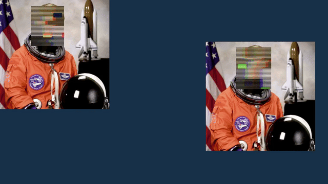

# BlurCam

**Blur, pixelate, distort, and anonymize faces locally.**

A native C++20 Linux CLI with YuNet face detection, optical-flow tracking, local effects,
FFmpeg file processing, SDL previews, and v4l2loopback virtual output. No accounts,
cloud inference, camera uploads, telemetry, or Python runtime in the video pipeline.

**Version 0.1.0.** See [validation](docs/VALIDATION.md) for measured results
and hardware checks. Face detection is fallible. Blur and pixelation do not guarantee
anonymity. For sensitive use, prefer `--preset max-privacy`, review the entire output,
and use box masks. Never assume a missed face has been hidden.



NASA public-domain sample; animated demo generated locally. No user footage.

## Install

Nix/NixOS (flake pins dependencies; does not modify your system):

```sh
nix run github:r3dg0d/blurcam -- --help
nix profile install github:r3dg0d/blurcam
blurcam models install
```

From a checkout:

```sh
nix build
./result/bin/blurcam models install
nix develop
cmake -S . -B build -DCMAKE_BUILD_TYPE=Release
cmake --build build -j
ctest --test-dir build --output-on-failure
```

Generic Linux requires CMake ≥3.24, C++20, OpenCV ≥4.8 (DNN, video, objdetect,
imgcodecs), FFmpeg ≥6 development libraries, CLI11 ≥2.4, toml++ ≥3.3,
SDL2, libcurl and OpenSSL. Python ≥3.11 and FFmpeg executables are needed only for tests.
Once those development packages are installed:

```sh
cmake -S . -B build -DCMAKE_BUILD_TYPE=Release -DBUILD_TESTING=OFF
cmake --build build -j
cmake --install build --prefix "$HOME/.local"
blurcam models install
```

See [NixOS configuration](docs/NIXOS.md) for loopback, NVIDIA and Home Manager.

## Use

```sh
blurcam file video.mp4 -o private.mp4 --effect blur
blurcam file video.mp4 private.mkv --effect pixelate --pixel-size 24
blurcam file video.mp4 cyber.mp4 --effect glitch --preset chaos --seed 42
blurcam file video.mp4 safe.mp4 --preset max-privacy
blurcam preview --preset privacy
blurcam webcam --device /dev/video0 --effect blur
blurcam virtualcam --device /dev/video0 --output /dev/video10 --preset max-privacy
blurcam devices
blurcam effects glitch
blurcam info
```

These are supported command forms. File, preview replay, live raw output and real loopback
were exercised with public sample/synthetic footage; see validation for hardware checks.
Normal commands never download anything. Install the 232,589-byte MIT YuNet model explicitly
once; SHA-256 is checked both on installation and on every detector startup.
Nix builds fetch the same checksum-pinned model as a test-only input; it is not bundled
with the installed package. Models live under `$XDG_DATA_HOME/blurcam/models` (default `~/.local/share/blurcam/models`).
`--model PATH` accepts the same pinned model, not arbitrary ONNX graphs.

### File output, audio and pipes

MP4, MKV and WebM use native FFmpeg decoding, encoding and muxing. Original video frame
PTS/durations and resolution are retained, including variable-rate input. Every compatible
audio stream is packet-copied. Incompatible audio/container combinations fail with an
explanation; choose MKV. Subtitles, chapters and attachments are not retained. Colors are
converted to 8-bit BGR/YUV; HDR, high-bit-depth and color metadata preservation are not
supported. Rotation-tagged inputs are rejected; normalize their orientation first.

`--codec auto` uses software H.264, or VP9 for WebM. Other choices: `h265`, `av1`, `ffv1`
(lossless YUV444 MKV), `h264_nvenc`, `hevc_nvenc`, `av1_nvenc`. 4:2:0 encoding requires
even dimensions; FFV1 permits odd dimensions. Outputs are created privately in the same
folder and committed atomically only after successful finalization. Existing paths are
not overwritten unless `--overwrite` is explicit. Input and output must differ.

```sh
cat input.mkv | blurcam file - -o private.mkv --preset max-privacy
blurcam file input.mp4 -o - --preset max-privacy > private.mkv
```

Stdout file output is streaming MKV. Stdin accepts formats that can be demuxed without
seeking (MKV or suitable MP4); some MP4 files need seeking. Live `--output -` is **raw
BGR24**, with no header/audio, using the actual input dimensions; stderr carries logs.

```sh
blurcam webcam --no-preview --output - --width 1280 --height 720 --preset privacy |
  ffmpeg -f rawvideo -pixel_format bgr24 -video_size 1280x720 -framerate 30 -i - out.mkv
```

### Effects

`blur`, `pixelate`, `glitch` / `rgb-glitch`, `rgbshift`, `scanlines`, `vhs`, `censor`,
`invert`, `thermal`, `posterize`, `neon`, and RGBA `overlay`.

```sh
blurcam preview --effect pixelate,rgbshift,scanlines --pixel-size 24
blurcam preview --effect pixelate --effect rgbshift --effect scanlines
blurcam preview --effect overlay --image mask.png
blurcam preview --effect blur --blur-radius 61 --blur-type gaussian
```

Stacks run in order. Blur radius is kernel width in pixels, rounded to odd; box blur
is also available. Pixel size is a block width in pixels. Glitch combines pixelation,
channel offsets, horizontal slices, corruption blocks and scanlines, with a deterministic
seed. Decorative effects (RGB shift, VHS, inversion, thermal, edges, posterization) and
transparent overlays can retain recognizable features. `privacy` selects coarse pixelation
plus fail-safe; `max-privacy` selects opaque face censoring plus fail-safe. Other presets:
`anonymous`, `cyberpunk`, `glitch`, `VHS`, `subtle`, `medium`, `chaos`.

### Tracking and fail-safe

All faces are processed by default. `--faces largest` or a numeric stable tracking ID
selects a subset; those options intentionally leave other people visible. IDs are session
local and can change after occlusion. `--max-faces 32` caps detections; overflow triggers
fail-safe when enabled. Five YuNet landmarks are available internally but are not a face
segmentation mask. `--mask box` is the conservative default; ellipses leave box corners
visible. `face` and `head` masks are deliberately rejected.

```sh
blurcam file input.mp4 private.mp4 --privacy-failsafe --padding 0.4 \
  --detection-interval 3 --confidence 0.8 --tracking-smoothing 0.45
```

Forward/backward Lucas–Kanade flow tracks texture between detections, with IoU association
and exponential box smoothing. Coverage includes raw detections and prior/predicted boxes,
so smoothing cannot move coverage away from a fresh detection. Detection refreshes
periodically and immediately on flow loss. Translation is tracked; scale/rotation updates
come from detection. Multiple overlapping faces can exchange IDs.

Fail-safe uses **opaque black**, independently of the selected effect/mask. Startup,
no detections, low-confidence tracks, detector exceptions, tracking loss, overflow and
resolution changes trigger protection. Two successful detection confirmations are required
for recovery. Stderr announces state changes and the preview title always shows uncertainty.
Normal file pixels are not annotated unless `--debug` is explicit.

`--failsafe-mode full-frame` is the default. `upper-body` censors the top 75% of the
frame; `last-known-region` retains padded boxes; `expanded-face` expands those boxes.
When there is no known box, every mode falls back to the whole frame. **These regional
modes are weaker and can expose faces elsewhere.** Even full-frame mode cannot protect
a face the detector never notices while another face remains confidently tracked. New
faces can enter between detection refreshes; use interval 1 for the most conservative
screening. No detector can establish that a frame contains no missed faces.

Ctrl+C discards incomplete file outputs. Live shutdown sends a final black frame before
closing loopback output, when writable. Abrupt power loss/process kill is outside this
cleanup guarantee; configure loopback timeout for sensitive use.

### Preview, latency and OBS

Preview uses SDL2 with Wayland/X11 support. `--input sample.mp4` replays a file at its
nominal rate without touching a physical camera. Keys:

| Key | Action |
| --- | --- |
| q / Escape | Quit |
| 1 / 2 / 3 / 4 / 5 | Blur / pixelate / glitch / censor / VHS |
| [ / ] | Decrease / increase blur and pixel strength |
| f | Toggle measured FPS in window title |
| d / t | Toggle debug boxes/IDs (also affects simultaneous outputs) |

Capture runs in a separate thread with a single replaceable latest-frame slot. It drops
stale frames instead of growing a queue. Tracking/inference/effects run synchronously in
the processing thread. File processing retains every decoded frame. Camera disconnects
stop with an error and a black final frame; automatic reconnect is not implemented.

OBS: start `blurcam virtualcam --preset max-privacy`, then add **Video Capture Device
(V4L2)** for the loopback device, select the actual resolution and disable buffering
where supported. Start BlurCam before selecting the camera in a browser/Discord because
exclusive-capability loopbacks become capture devices only while a producer is connected.
No OBS plugin is required. PipeWire-native virtual sources and portal screen capture are
future work; v4l2loopback does not require X11 screen capture on Wayland.

### GPU

OpenCV DNN selects CUDA when the library exposes a CUDA target; explicit `--backend cuda`
errors if unavailable. `auto` uses CPU otherwise and retries on CPU if CUDA inference
fails. The default Nix package is CPU inference. Native **NVENC encoding was tested** on
an RTX 4090. Inference CUDA requires a CUDA/cuDNN-enabled OpenCV build and is not validated
in the default package. Tracking, effects and decoding are CPU. This is not a zero-copy
NVDEC→CUDA→NVENC pipeline.

```sh
blurcam file input.mp4 gpu.mp4 --codec h264_nvenc --verbose
```

On NixOS the driver libraries may need:
`LD_LIBRARY_PATH=/run/opengl-driver/lib blurcam file ... --codec h264_nvenc`.
`--backend` selects inference; `--device` selects the camera and avoids an ambiguous flag.
NVENC is explicit so `auto` does not unexpectedly select an unavailable/proprietary encoder.

### Configuration

Precedence: defaults → global TOML → built-in `--preset` → user `--profile` → CLI.
Global config: `$XDG_CONFIG_HOME/blurcam/config.toml` (default `~/.config/blurcam/config.toml`).
`--config PATH` selects another file. `--save-config PATH` writes effective settings using
exclusive creation. A saved TOML file can be reused as a preset via `--config PATH`.
`--no-privacy-failsafe` explicitly disables a config/preset flag.

```toml
[camera]
width = 1280
height = 720
fps = 30
[detection]
confidence = 0.8
interval = 3
size = 640
max_faces = 32
[tracking]
padding = 0.4
smoothing = 0.45
privacy_failsafe = true
failsafe_mode = "full-frame"
[effects]
stack = ["pixelate"]
pixel_size = 28
mask = "box"
[compute]
backend = "auto"
threads = 2
[output]
codec = "auto"
[profiles.censor.effects]
stack = ["censor"]
```

### Benchmarks and tests

```sh
blurcam benchmark --resolution 1920x1080 --fps 60 --frames 120 --effect pixelate
BLURCAM_TEST_MODEL="$HOME/.local/share/blurcam/models/yunet-2023mar.onnx" \
  ctest --test-dir build --output-on-failure
python3 scripts/benchmark.py --binary build/blurcam --output benchmarks
```

Benchmark JSON separates detector per-call and amortized timing, tracker, ROI-mask geometry,
effects, total mean/p95 and throughput. It uses synthetic texture and one ground-truth
tracker/effect region. It is a processing microbenchmark, not real camera latency or
real-world detection accuracy. Capture/drop/encoder/latency fields are null when unmeasured.
Live mode logs actual capture count, queue drops and final capture-to-output time.
Results and reproduction details: [performance](docs/VALIDATION.md).

Tests cover deterministic effects, unchanged pixels outside the ROI, masks, padding,
tracking translation/IDs, detector loss/errors, occlusion, low confidence, overflow,
resolution changes, config precedence, argument errors, atomic output, audio packet
identity, frame count, constant/variable timestamps, stdin/stdout, SDL dummy preview,
and raw live fail-safe. Optional model tests use a documented public-domain NASA fixture.
See [architecture](docs/ARCHITECTURE.md), [contributing](CONTRIBUTING.md), and
[security](SECURITY.md). `blurcam completions bash|zsh|fish` emits basic completions;
packages install these and `man blurcam`.

## Troubleshooting

* Model missing: run `blurcam models install`; verify TLS/network access only for this step.
* No camera: run `blurcam devices`; check device permissions, video group, and other producers.
* No virtual camera: configure v4l2loopback as documented; BlurCam never loads kernel modules.
* Backend CUDA unavailable: your OpenCV has no usable CUDA DNN target; use CPU or rebuild it.
* NVENC failure: check `nvidia-smi`, FFmpeg encoder availability and driver library paths.
* Preview cannot open: check the Wayland/X11 session and SDL video backend; headless file
  processing needs no display.
* Audio incompatible: use MKV or explicitly transcode audio before processing.
* Face missed: review output, increase detector size/padding, lower confidence if appropriate,
  detect more often, and use opaque censoring/full-frame fail-safe. Accuracy depends on
  face scale, pose, motion, lighting and occlusion; there is no privacy guarantee.

## License

BlurCam source: MIT. YuNet model: MIT, separately installed; upstream notice in
[docs/YUNET-LICENSE](docs/YUNET-LICENSE). Dependency licenses and GPL-enabled FFmpeg
binary distribution considerations are recorded in [dependencies](docs/DEPENDENCIES.md).
